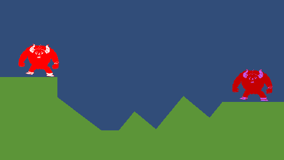
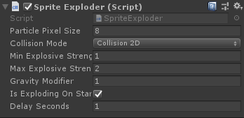
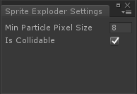

# Indie Dev Tool : Sprite Exploder

## Sprite Exploder

#### Description
A component that will explode any sprite into an array of particles.
The sprite exploder is highly optimized to allow for hundreds of thousands of particles in a scene.
Developers can also define global settings to specify particle attributes and allow players to leverage their CPU power for more spectacular effects.

#### Component Parameters

Name | Description 
--- | --- 
**Particle Pixel Size** | The square pixel size of each particle that the sprite will separated into 
**Collision Mode** | Which collision mode the particle system will use: None, 2D, or 3D
**Min Explosive Strength** | The minimum amount of explosive force that will be applied to the particles
**Max Explosive Strength** | The maximum amount of explosive force that will be applied to the particles
**Is Exploding On Start** | Whether or not the sprite will explode automatically on the Unity start event
**Delay Seconds** | The amount of delay before the explosion happens

#### Public Methods

Name | Description 
--- | --- 
**Explode** | Triggers the sprite to explode. An optional *explosionCenter* parameter can be used to offset the center of the explosion

## Sprite Exploder Settings

#### Description
Settings that define global *Sprite Exploder* parameters. Values can be set in the editor or at runtime.
These are accesible via the menu item at *Edit > Sprite Exploder Settings...* or via the scriptable object located in *Assets/SpriteExploder/Resources/SpriteExploderSettings*

#### Settings Parameters

Name | Description 
--- | --- 
**Min Particle Pixel Size** | The minimum particle pixel size that all *Sprite Exploder* components will use
**Is Collidable** | Whether or not a *Sprite Exploder* component particles are able to use collision physics